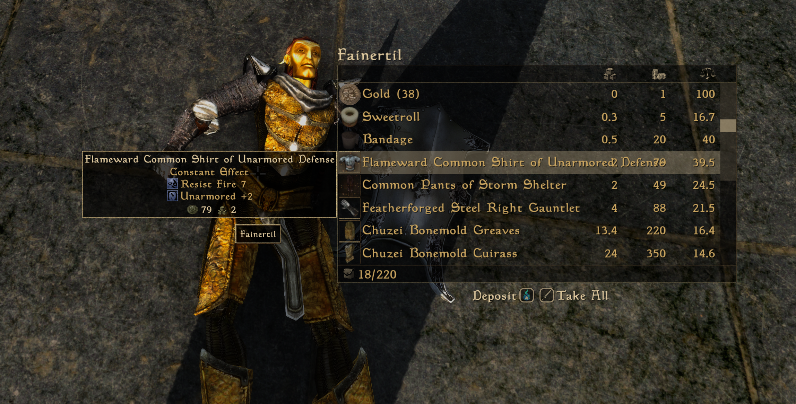

# Fortune's Spoils - Randomised Equipment

Randomised loot for OpenMW, featuring tiered prefixes and suffixes, modified
equipment stats, and custom unique items. Configurable drop rates, optional
content support, and an interactive modifier catalogue.

**Early beta: functional, but not balanced for regular play.** Bugs, oversights
and balance feedback are welcome. Use a separate profile and back up saves;
release validation remains pending.

## Play The Early Beta

Version **0.1.0** is the first early-beta release candidate. Requires Morrowind
and OpenMW 0.51+. Tribunal, Bloodmoon and OAAB Data are optional.

[Release Downloads](https://github.com/STiX360/FortunesSpoils-RandomisedEquipment/releases)
| [Installation](release/INSTALL.md)
| [Modifier Catalogue](https://stix360.github.io/FortunesSpoils-RandomisedEquipment/)
| [Loot Simulator](https://stix360.github.io/FortunesSpoils-RandomisedEquipment/simulator.html)
| [Report A Problem](https://github.com/STiX360/FortunesSpoils-RandomisedEquipment/issues)

Install the **production ZIP**, not GitHub's automatically generated source-code
archive. The ZIP contains only the installable scripts, localisation and OpenMW
content manifest. The installation guide is a separate release download.

Existing saves work by default. NPC inventories are capped on first observation;
items sold or planted before that snapshot may roll. This is an accepted
compatibility trade-off. Strict Inventory Tracking can restore the earlier
new-game requirement. Back up saves before installing or updating.



*Player-provided in-game example: Flameward Common Shirt of Unarmored Defense,
Common Pants of Storm Shelter, and Featherforged Steel Right Gauntlet. Screenshot
from a modded game; other visible content and appearance are not supplied by this mod.*

The website's Loot Simulator is a player-reference tool, **not an in-game feature**.

The current ordinary-affix [utility progression](docs/AFFIX-PROGRESSION.md)
includes timed-to-constant Water Breathing/Walking, Slowfall and Levitate tiers.
Other utility effects retain CE with magnitude/range scaling. Previously generated
items are not retroactively rebalanced. Automated checks do not establish in-game
release readiness; see the [release checklist](release/READINESS.md).

## Repository Boundaries

This folder is the active working root. The previous Morrowind workspace is
historical and is not used as a build input or synchronised source.
Keep non-public notes, screenshots, and local audit outputs under `local/` or
`private/`; both are ignored. Historical reports and the old development
snapshot are ignored too. Required authoring tables and curated item catalogues
remain publishable so a clean GitHub checkout can build the website and mod.

| Directory | Purpose | Distributed in the mod ZIP? |
| --- | --- | --- |
| `mod/` | Installable Lua scripts, localisation, OpenMW manifest | Yes |
| `data/` | Authoring registry and frozen/protected item lists | No |
| `site/` | Static catalogue template | No |
| `tools/` | Export, build, and optional game-data inspection tools | No |
| `docs/` | Installation, research, design, historical reports | No |
| `tests/` | Manually invoked tests; some retain prototype assumptions | No |
| `release/` | Version, packaging profiles, installation and release notes | No; guide is a companion download |
| `build/`, `dist/` | Generated output; ignored by Git | Not source |

## Build

Python 3.10+; normal builds use the standard library and need no installed game
masters. Run commands from the repository root:

```powershell
python tools/build.py site
python tools/build.py package --profile testing
```

Open `build/site/index.html` directly in a browser. Website output is static and
can be deployed to GitHub Pages. Runtime-only ZIPs, companion manifests,
SHA-256 sidecars and `INSTALL.md` appear in `dist/`.

The Loot Simulator is at `build/site/simulator.html`, linked from the catalogue.
It runs the bundled Lua loot rules offline with selectable bases, NPC levels and
mapped locations. See [Simulator Details](docs/LOOT-SIMULATOR.md).
The simulator is a website-only player reference, not an in-game mod feature.

Production defaults use 33% single affix, 33% dual affix, 33% unchanged and 1%
global unique chance (eligible non-projectiles with feasible outcomes):

```powershell
python tools/build.py package --profile production
python tools/verify_release.py dist/fortunes-spoils-0.1.0-production.zip --version 0.1.0 --profile production
```

Saved settings override package defaults. Production logging defaults off; this
profile is not a claim of engine validation. No build task
runs tests. Export authoring changes explicitly with `python tools/build.py export`;
this updates generated Lua in `mod/` and generated expanded-affix documentation.

## Runtime Identity

The public working title is Fortune's Spoils. The manifest, Lua namespace, and
settings label retain Randomised Basic Loot to avoid a saved-script identity
change. See [installation](release/INSTALL.md) and [testing notes](docs/TESTING.md).

## Publishing

Pushing a matching version tag automatically packages and publishes an early-beta
GitHub prerelease using production defaults. Manual dispatch defaults to a draft;
its Publish option can backfill an existing tag. Nexus uploads remain manual.
Pages deploys on push to `main` or manual dispatch. No scheduled publishing or
automatic tests are enabled. Version 0.1.0 remains a prerelease. See the
[step-by-step publishing guide](docs/PUBLISHING.md).

## Rights

No project licence has been granted at this stage. This repository is not
advertised as open source. Third-party rights remain with their owners; see
[provenance review](docs/THIRD-PARTY-NOTICES.md). Game masters and original assets
must not be committed or included in release archives.
